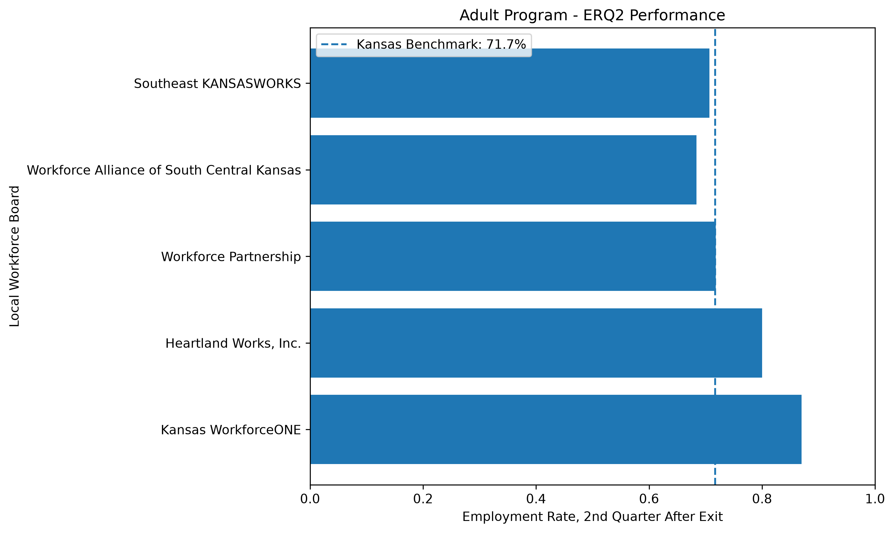
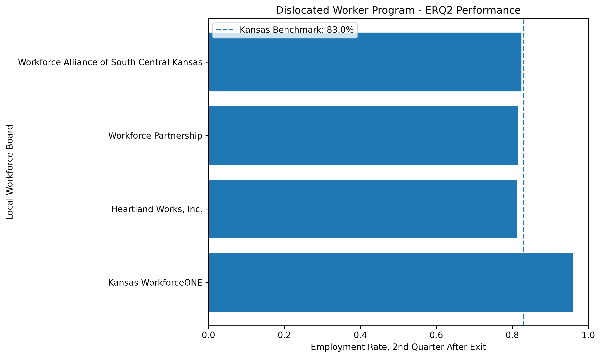
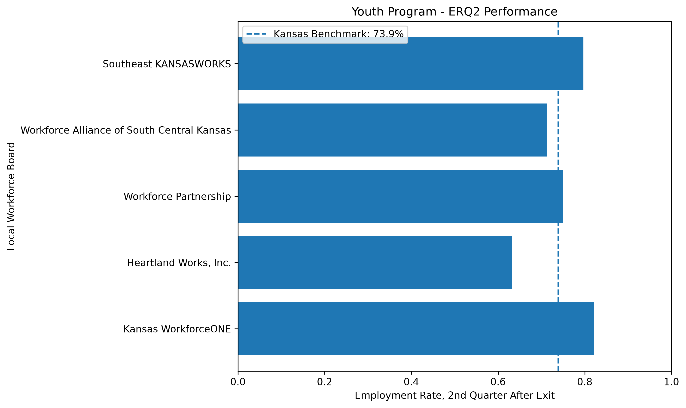
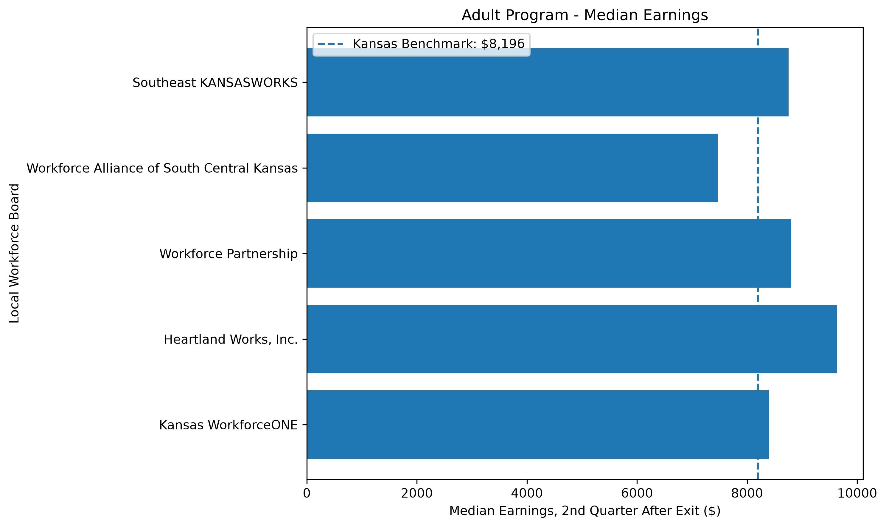
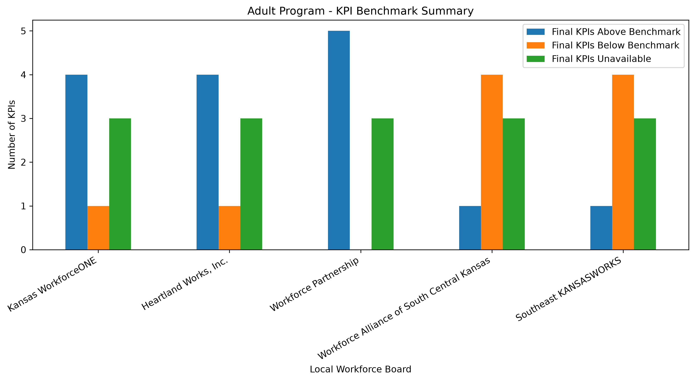

# Kansas Workforce Program Performance Analysis

## Project Overview

This project analyzes Kansas Workforce Innovation and Opportunity Act (WIOA) program performance across local workforce boards.

The analysis focuses on three major WIOA programs:

- Adult
- Dislocated Worker
- Youth

The goal is to compare local workforce board performance with Kansas statewide benchmarks and identify differences across key workforce outcome measures.

## Data Source

Source: U.S. Department of Labor WIOA Local Area Performance Results

Reporting period: PY2024 / June 30, 2025 performance files.

The project uses separate performance files for:

- Adult
- Dislocated Worker
- Youth

## Key Performance Indicators

The analysis includes:

- Participants
- Trained Participants Rate
- Work Experience Rate
- Registered Apprenticeship Rate
- ERQ2 — Employment Rate, 2nd Quarter After Exit
- ERQ4 — Employment Rate, 4th Quarter After Exit
- MEQ2 — Median Earnings, 2nd Quarter After Exit
- CRED — Credential Attainment Rate
- MSG — Measurable Skill Gains

## Analysis Process

The project workflow included:

1. Inspecting the original WIOA Excel files
2. Filtering records for Kansas
3. Combining Adult, Dislocated Worker, and Youth programs
4. Separating local workforce boards from statewide benchmark records
5. Validating KPI numerator and denominator values
6. Treating invalid or suppressed values as unavailable rather than zero
7. Calculating gaps between local board results and Kansas statewide benchmarks
8. Classifying available KPI results as:
   - Above Benchmark
   - Below Benchmark
   - At Benchmark
   - Unavailable
9. Creating static charts with Matplotlib
10. Creating an interactive dashboard with Plotly

## Kansas Workforce Boards Analyzed

- Kansas WorkforceONE
- Heartland Works, Inc.
- Workforce Partnership
- Workforce Alliance of South Central Kansas
- Southeast KANSASWORKS

## Dashboard

The interactive dashboard includes:

- KPI summary cards
- ERQ2 employment-rate comparisons
- ERQ4 employment-rate comparisons
- Median earnings comparisons
- KPI benchmark-status summaries

Dashboard file:

`dashboard/kansas_wioa_full_dashboard.html`

## Important Data Quality Considerations

Suppressed or invalid KPI values were not treated as zero.

For rate-based measures, numerator and denominator values were checked before performance comparisons were calculated.

Results based on small denominators should be interpreted carefully because small cohorts can cause large changes in percentage-based performance measures.

## Project Structure

```text
Kansas Workforce Program Performance Analysis/
│
├── data/
│   ├── raw/
│   └── processed/
│
├── scripts/
│
├── outputs/
│
├── dashboard/
│
├── reports/
│
├── requirements.txt
│
└── README.md

```

## Key Findings

### Adult Program

- Kansas WorkforceONE reported an ERQ2 employment rate of 87.0%, above the Kansas benchmark of 71.7%.
- Heartland Works, Inc. reported an ERQ2 rate of 80.0%.
- Workforce Partnership was close to the statewide ERQ2 benchmark at 71.8%.
- Workforce Alliance of South Central Kansas and Southeast KANSASWORKS were below the statewide ERQ2 benchmark.
- Median earnings varied across local boards, showing differences in post-program employment outcomes.

### Dislocated Worker Program

- Kansas WorkforceONE reported an ERQ2 rate of 96.0%, compared with the Kansas benchmark of 83.0%.
- Workforce Alliance of South Central Kansas reported median earnings of approximately $15,758.
- Workforce Partnership reported median earnings of approximately $14,888.
- Some Southeast KANSASWORKS measures were unavailable because the source data contained invalid or suppressed numerator or denominator values.
- Workforce Alliance had a valid credential attainment rate of 0% based on 0 credentials from a denominator of 5.

### Youth Program

- Kansas WorkforceONE reported an ERQ2 rate of 82.1%.
- Southeast KANSASWORKS reported an ERQ2 rate of 79.7%.
- Workforce Partnership reported an ERQ2 rate of 75.0%.
- Southeast KANSASWORKS reported youth median earnings of approximately $6,585.

## Business Interpretation

The analysis shows differences in employment, earnings, credential attainment, and skill-gain outcomes across Kansas local workforce boards.

This type of analysis can support:

- comparison with statewide benchmarks
- identification of outcomes that may require further review
- monitoring of employment and earnings outcomes
- identification of missing or suppressed data
- program-performance reporting
- data-informed management decisions

Performance measures should not be interpreted independently of cohort size. Some local board and program combinations have relatively small denominators, which can make percentage-based measures more volatile.

## Visual Results

### Adult Program — ERQ2


### Dislocated Worker Program — ERQ2


### Youth Program — ERQ2


### Median Earnings — Adult Program


### KPI Benchmark Summary — Adult Program


## Tools Used

- Python
- pandas
- NumPy
- Matplotlib
- Plotly
- Excel
- VS Code
- Git
- GitHub

## Skills Demonstrated

- Workforce program evaluation
- KPI tracking
- Data cleaning and validation
- Benchmark analysis
- Program performance reporting
- Data visualization
- Interactive dashboard development
- Python data analysis
- Decision-support reporting

